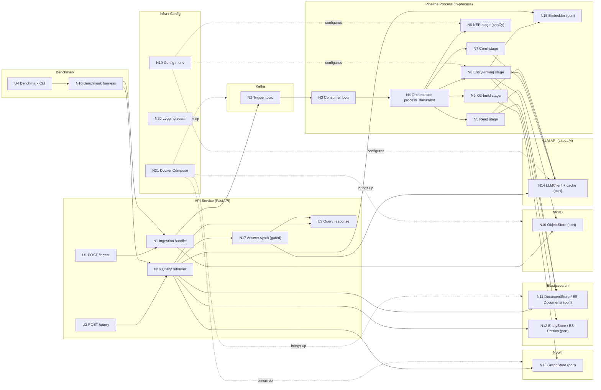

# BREADBOARD — Graph RAG Demo (Detail A)

> Concrete affordances and wiring for **Shape A** (the ADR-decided architecture
> in [`SHAPING.md`](./SHAPING.md)). This is a *detailing* of A, not an
> alternative shape.
>
> **Built via inline fallback** — the standalone `/breadboarding` skill is not
> installed; this doc follows the breadboard spec embedded in `/shaping` (UI +
> Non-UI affordance tables + a Place-grouped wiring diagram). See
> [`WORKFLOW-PAINPOINTS.md`](./WORKFLOW-PAINPOINTS.md) #13.
>
> **Tables are the source of truth; the Mermaid diagram renders them.** Change a
> table (and its `Wires Out`) first, then regenerate the diagram.

**Places** (where affordances live): **API Service** (FastAPI) · **Kafka** ·
**Pipeline Process** (in-process orchestrator + stages + local models) ·
**MinIO** · **Elasticsearch** (two indices) · **Neo4j** · **LLM API**
(external, via LiteLLM) · **Benchmark** · **Infra/Config**.

The frontend is out of scope (R7.6 / PRD), so the UI surface is deliberately
thin — the operator/analyst touchpoints are the HTTP API and the benchmark CLI,
not a browser UI.

---

## UI Affordances

Things a user directly interacts with (here: HTTP request/response surface + CLI).

| ID | Affordance | Place | What the user does / sees | Wires Out | From |
|----|-----------|-------|---------------------------|-----------|------|
| **U1** | `POST /ingest` (multipart file) | API Service | Operator uploads a Markdown/text file; gets back the deterministic `document_id` + ack | → N1 | A1 |
| **U2** | `POST /query` (`{question, synthesize?}`) | API Service | Analyst asks a question; optional `synthesize` flag opts into prose (default off) | → N16 | A9 |
| **U3** | Query response payload | API Service | Analyst reads: predicted answer (top entity node), ranked subgraph, supporting sentences, per-edge provenance | ← N16, ← N17 | A9 |
| **U4** | Benchmark CLI (`run --subset …`) | Benchmark | Evaluator runs the fixed subset; sees supporting-fact P/R/F1 + answer EM/token-F1 printed | → N18 | A11 |

---

## Non-UI Affordances

Handlers, stores, queries, services, ports. The six **ports** (⇢ marked) are the
primary test seam — real adapters in prod, in-memory fakes in the fast suite.

| ID | Affordance | Place | Responsibility | Wires Out | From |
|----|-----------|-------|----------------|-----------|------|
| **N1** | Ingestion handler | API Service | Write uploaded bytes to object storage; publish `{bucket, objectKey}` trigger | → N10 ⇢, → N2 | A1 |
| **N2** | Kafka trigger topic | Kafka | Hold `{bucket, objectKey}` trigger messages | → N3 | A1 |
| **N3** | Consumer loop (thin driver) | Pipeline Process | Resolve one trigger → call `process_document({bucket, objectKey})` | → N4 | A1 |
| **N4** | Pipeline orchestrator (`process_document`) | Pipeline Process | Compute deterministic `document_id`; run 5 stages in-memory; log-and-drop on failure; write only at checkpoints | → N5, → N6, → N7, → N8, → N9 | A1 |
| **N5** | Read stage | Pipeline Process | Fetch document bytes for `{bucket, objectKey}`; write the **raw-text ES-Documents record before processing** (ADR-0001 / Q46) | → N10 ⇢, → N11 ⇢ | A1 |
| **N6** | NER stage | Pipeline Process | spaCy `en_core_web_trf` → typed mentions + char spans + sentence segmentation (one pass) | → N19 | A3 |
| **N7** | Coreference stage | Pipeline Process | LLM cluster map (non-destructive) → doc-level entities | → N14 ⇢ | A4 |
| **N8** | Entity-linking stage | Pipeline Process | Block by type+normalized name → score by embedding sim → merge/create-new; gated tie-break/NIL off; write per-doc EL + canonical entities at checkpoint | → N12 ⇢, → N20 ⇢, → N14 ⇢, → N11 ⇢ | A5 |
| **N9** | KG-build stage | Pipeline Process | LLM triples over canonical IDs (closed predicates + `RELATED_TO` fallback); resolve `char_start/end` from N6 segmentation; attach edge provenance; write graph at checkpoint | → N14 ⇢, → N13 ⇢ | A7 |
| **N10** | `ObjectStore` port ⇢ (MinIO adapter) | MinIO | Read/write document bytes by `{bucket, objectKey}` | — | A1 |
| **N11** | `DocumentStore` port ⇢ (ES-Documents adapter) | Elasticsearch | Read/write the per-document record: text, NER mentions+spans, coref map, per-doc EL, passage/sentence `dense_vector`s | — | A6 |
| **N12** | `EntityStore` port ⇢ (ES-Entities adapter) | Elasticsearch | Upsert canonical entities; blocking + kNN search over entity `dense_vector`s | — | A6 |
| **N13** | `GraphStore` port ⇢ (Neo4j adapter) | Neo4j | Write multi-label nodes + provenance-carrying edges; run k-hop traversal | — | A7 |
| **N14** | `LLMClient` port ⇢ (LiteLLM + response cache) | LLM API | Provider-agnostic calls; per-stage model config; `sha256(model+prompt+params)` cache; Pydantic-validated structured output + retry | → LLM API | A10 |
| **N15** | `Embedder` port ⇢ (sentence-transformer) | Pipeline Process | Local `bge-small-en-v1.5`: embed mention-in-context, canonical entities, passages/sentences | — | A8 |
| **N16** | Query retriever | API Service | Embed question → kNN seed on entities + passages → k-hop expand → rank subgraph + supporting sentences; entity-typed answer = top node | → N15 ⇢, → N12 ⇢, → N11 ⇢, → N13 ⇢, → N17 | A9 |
| **N17** | Answer synthesizer (gated, off by default) | API Service | Feed retrieved subgraph + sentences to the LLM for prose | → N14 ⇢ | A9 |
| **N18** | Benchmark harness | Benchmark | Ingest 2WikiMultihopQA context paragraphs as corpus (fixed order); run fixed subset through N16; score non-LLM metrics vs `name`+`aliases`; reuse warm cache + pre-built graph | → N1, → N16 | A11 |
| **N19** | Config / `.env` loader | Infra/Config | Supply endpoints, keys, per-stage models, EL thresholds, k-hop depth | → (all adapters/clients) | A12 |
| **N20** | Logging seam | Infra/Config | Basic `logging` behind an interface (structured/JSON swappable later) | — | A12 |
| **N21** | Docker Compose | Infra/Config | Bring up Kafka, MinIO, one ES cluster (2 indices), Neo4j, API service — one command | → (all Places) | A12 |

**Notes**
- **N6 → N19** is a config/read dependency (models & settings), not a data
  handoff; the NER→coref→EL→KG data handoff is in-memory inside N4 (A1's
  checkpoint model), which is why stages don't wire directly to each other's
  storage except at the defined writes: **N5→N11 (raw text at ingest)**,
  **N8→N11 (enrich record at the EL checkpoint)**, **N8→N12 (canonical
  entities)**, **N9→N13 (graph)**. (Raw-text-at-ingest per ADR-0001 / Q46.)
- **Orthogonal concerns surfaced:** the `Embedder` (N15) is shared by both the
  ingestion path (N8) and the query path (N16) — a reuse seam, not a duplication.
  `LLMClient`+cache (N14) is likewise shared across N7/N9/N17. These being single
  affordances (not per-stage copies) is what makes R6.1/R6.3 hold.
- **DATE** has no node affordance by design (A7 / R4.3): it rides on N13 edges as
  a qualifier.

---

## Wiring Diagram (rendered from the tables, grouped by Place)

---

## Orthogonal concerns (candidate slice boundaries)

The breadboard reveals which affordances are independent — useful for C5
(slicing). Grouped by the vertical they belong to:

1. **Ingestion spine** — U1, N1, N2, N3, N4, N5 + the `ObjectStore` port (N10).
   Demo-able: upload a file, watch it land in MinIO and a trigger fire.
2. **Extraction** — N6 (NER) + N7 (coref). Demo-able: mentions + spans + coref
   clusters for one document.
3. **Unification + storage** — N8 (EL) + the ES ports (N11, N12) + Embedder
   (N15). Demo-able: same entity across two docs → one canonical record.
4. **Graph build** — N9 + `GraphStore` (N13). Demo-able: triples + provenance
   edges queryable in Neo4j.
5. **Retrieval** — N16 (+ N17 gated). Demo-able: a multi-hop question → ranked
   subgraph + supporting sentences + top-node answer.
6. **Benchmark** — N18 + U4. Demo-able: metrics printed for the fixed subset.

Cross-cutting (touch every slice, not a slice themselves): N14 (LLMClient+cache),
N15 (Embedder), N19/N20/N21 (config/logging/compose), and the A2 port seam.

---

## Slices

**Done — see [`SLICES.md`](./SLICES.md).** The 6 orthogonal concerns above are
sequenced into 8 demo-able vertical slices (V1 walking skeleton → V6 multi-hop
retrieval on the critical path; V7 gated synthesis + V8 benchmark hang off V6).
